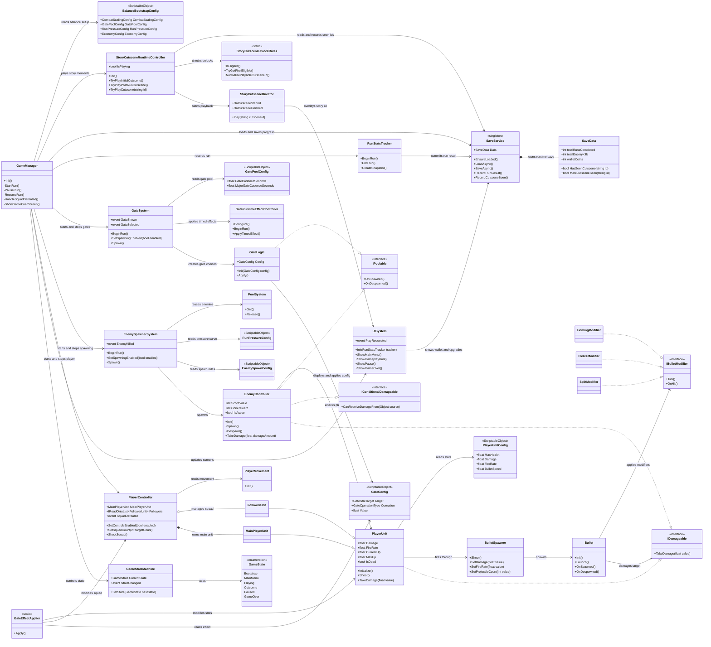
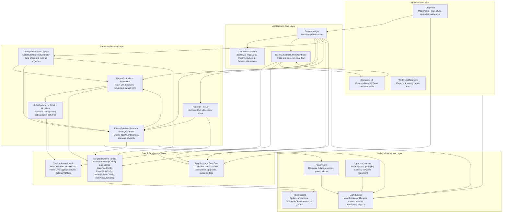

# True Gate Architecture Diagrams

Tai lieu nay gom 2 diagram chinh co the dan truc tiep vao bao cao:

- Class diagram: mo ta cac class quan trong va quan he giua chung.
- Layered architecture: mo ta kien truc he thong theo cac tang.

## Class Diagram

## Layered Architecture

## Notes For Report

- `GameManager` la trung tam dieu phoi vong choi: bat dau run, pause/resume, xu ly game over va kich hoat cutscene.
- Gameplay duoc chia thanh cac module nho: Player, Enemy, Combat, Gate, Stats. Moi module co trach nhiem rieng va duoc `GameManager` ket noi lai.
- Data runtime duoc tach ra khoi logic bang `ScriptableObject`, giup can bang game ma khong can sua code.
- `SaveService` quan ly tien trinh nguoi choi, nang cap, ket qua run va cac cutscene da xem.
- `StoryCutsceneRuntimeController` ket noi he thong cutscene vao game chinh bang cach doc `SaveData`, kiem tra unlock rules va yeu cau `StoryCutsceneDirector` phat cutscene.
