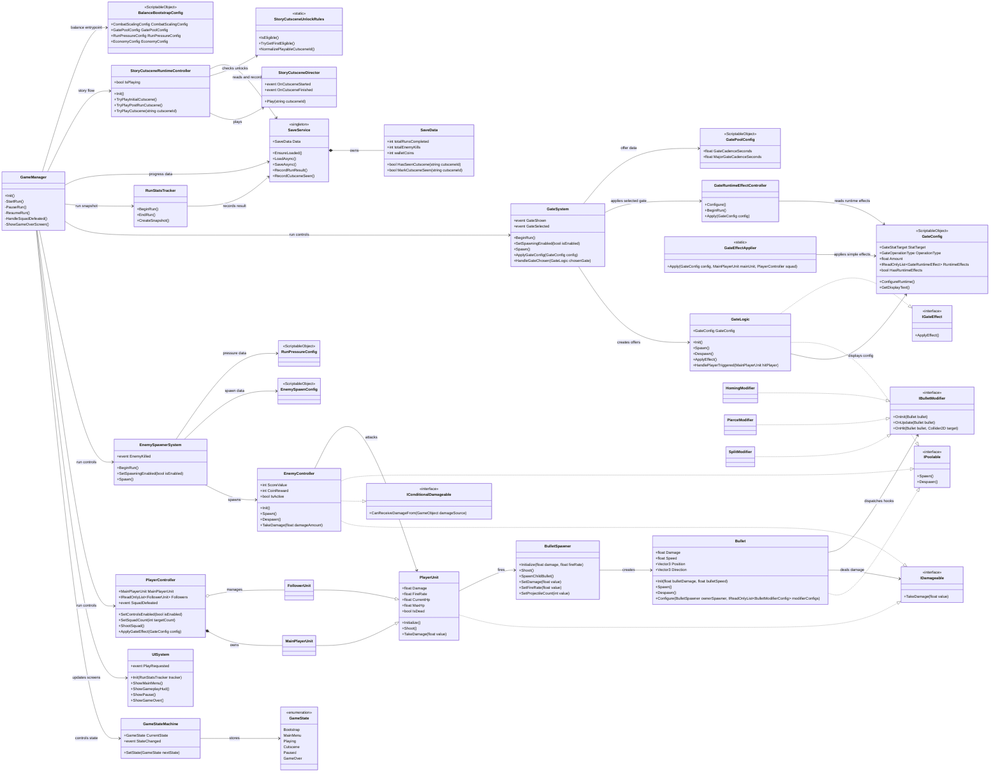
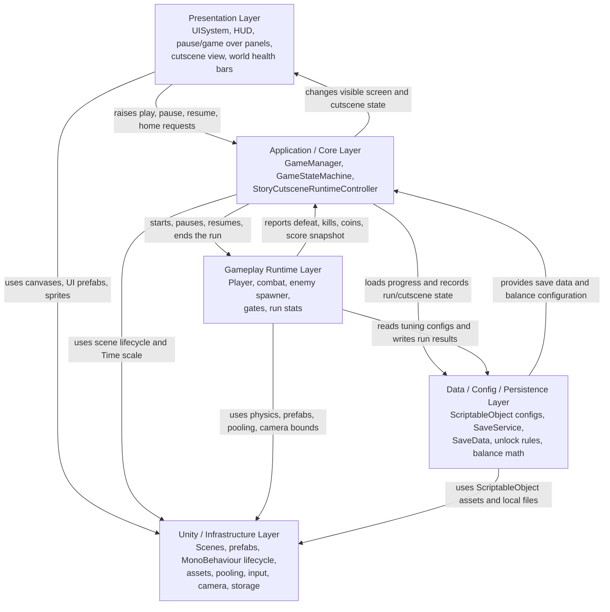
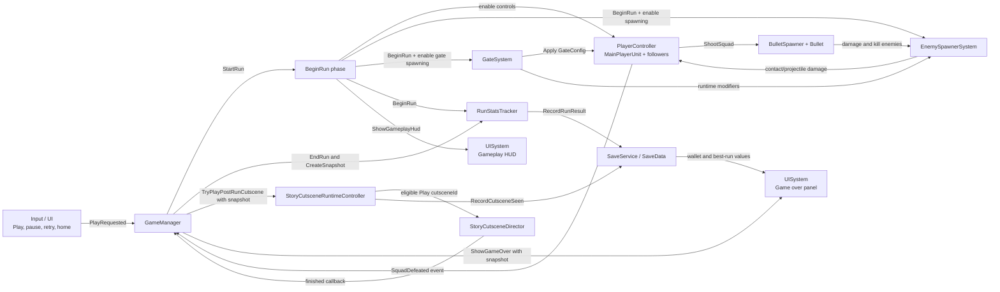

# True Gate Architecture Diagrams

Tai lieu nay gom 3 diagram co the dan truc tiep vao bao cao:

- Class diagram: tap trung vao cac class runtime quan trong va ten method/property dang co trong code.
- Layered architecture: mo ta kien truc theo tang, chi giu cac mui ten cap he thong.
- Gameplay runtime flow: mo ta duong chay chinh tu UI/Input den run, game over, save va cutscene.

## Class Diagram

```mermaid
classDiagram
    direction LR

    class GameManager {
        +Init()
        -StartRun()
        -PauseRun()
        -ResumeRun()
        -HandleSquadDefeated()
        -ShowGameOverScreen()
    }

    class GameStateMachine {
        +GameState CurrentState
        +SetState(GameState nextState)
        +event StateChanged
    }

    class GameState {
        <<enumeration>>
        Bootstrap
        MainMenu
        Playing
        Cutscene
        Paused
        GameOver
    }

    class UISystem {
        +Init(RunStatsTracker tracker)
        +ShowMainMenu()
        +ShowGameplayHud()
        +ShowPause()
        +ShowGameOver()
        +event PlayRequested
    }

    class RunStatsTracker {
        +BeginRun()
        +EndRun()
        +CreateSnapshot()
    }

    class PlayerController {
        +MainPlayerUnit MainPlayerUnit
        +IReadOnlyList~FollowerUnit~ Followers
        +SetControlsEnabled(bool isEnabled)
        +SetSquadCount(int targetCount)
        +ShootSquad()
        +ApplyGateEffect(GateConfig config)
        +event SquadDefeated
    }

    class PlayerUnit {
        +float Damage
        +float FireRate
        +float CurrentHp
        +float MaxHp
        +bool IsDead
        +Initialize()
        +Shoot()
        +TakeDamage(float value)
    }

    class MainPlayerUnit
    class FollowerUnit

    class EnemySpawnerSystem {
        +BeginRun()
        +SetSpawningEnabled(bool isEnabled)
        +Spawn()
        +event EnemyKilled
    }

    class EnemyController {
        +int ScoreValue
        +int CoinReward
        +bool IsActive
        +Init()
        +Spawn()
        +Despawn()
        +TakeDamage(float damageAmount)
    }

    class GateSystem {
        +BeginRun()
        +SetSpawningEnabled(bool isEnabled)
        +Spawn()
        +ApplyGateConfig(GateConfig config)
        +HandleGateChosen(GateLogic chosenGate)
        +event GateShown
        +event GateSelected
    }

    class GateLogic {
        +GateConfig GateConfig
        +Init()
        +Spawn()
        +Despawn()
        +ApplyEffect()
        +HandlePlayerTriggered(MainPlayerUnit hitPlayer)
    }

    class GateRuntimeEffectController {
        +Configure()
        +BeginRun()
        +Apply(GateConfig config)
    }

    class GateEffectApplier {
        <<static>>
        +Apply(GateConfig config, MainPlayerUnit mainUnit, PlayerController squad)
    }

    class BulletSpawner {
        +Initialize(float damage, float fireRate)
        +Shoot()
        +SpawnChildBullet()
        +SetDamage(float value)
        +SetFireRate(float value)
        +SetProjectileCount(int value)
    }

    class Bullet {
        +float Damage
        +float Speed
        +Vector3 Position
        +Vector3 Direction
        +Init(float bulletDamage, float bulletSpeed)
        +Spawn()
        +Despawn()
        +Configure(BulletSpawner ownerSpawner, IReadOnlyList~BulletModifierConfig~ modifierConfigs)
    }

    class IBulletModifier {
        <<interface>>
        +OnInit(Bullet bullet)
        +OnUpdate(Bullet bullet)
        +OnHit(Bullet bullet, Collider2D target)
    }

    class HomingModifier
    class PierceModifier
    class SplitModifier

    class IDamageable {
        <<interface>>
        +TakeDamage(float value)
    }

    class IConditionalDamageable {
        <<interface>>
        +CanReceiveDamageFrom(GameObject damageSource)
    }

    class IPoolable {
        <<interface>>
        +Spawn()
        +Despawn()
    }

    class IGateEffect {
        <<interface>>
        +ApplyEffect()
    }

    class SaveService {
        <<singleton>>
        +SaveData Data
        +EnsureLoaded()
        +LoadAsync()
        +SaveAsync()
        +RecordRunResult()
        +RecordCutsceneSeen()
    }

    class SaveData {
        +int totalRunsCompleted
        +int totalEnemyKills
        +int walletCoins
        +bool HasSeenCutscene(string cutsceneId)
        +bool MarkCutsceneSeen(string cutsceneId)
    }

    class StoryCutsceneRuntimeController {
        +bool IsPlaying
        +Init()
        +TryPlayInitialCutscene()
        +TryPlayPostRunCutscene()
        +TryPlayCutscene(string cutsceneId)
    }

    class StoryCutsceneDirector {
        +Play(string cutsceneId)
        +event OnCutsceneStarted
        +event OnCutsceneFinished
    }

    class StoryCutsceneUnlockRules {
        <<static>>
        +IsEligible()
        +TryGetFirstEligible()
        +NormalizePlayableCutsceneId()
    }

    class BalanceBootstrapConfig {
        <<ScriptableObject>>
        +CombatScalingConfig CombatScalingConfig
        +GatePoolConfig GatePoolConfig
        +RunPressureConfig RunPressureConfig
        +EconomyConfig EconomyConfig
    }

    class GateConfig {
        <<ScriptableObject>>
        +GateStatTarget StatTarget
        +GateOperationType OperationType
        +float Amount
        +IReadOnlyList~GateRuntimeEffect~ RuntimeEffects
        +bool HasRuntimeEffects
        +ConfigureRuntime()
        +GetDisplayText()
    }

    class GatePoolConfig {
        <<ScriptableObject>>
        +float GateCadenceSeconds
        +float MajorGateCadenceSeconds
    }

    class EnemySpawnConfig {
        <<ScriptableObject>>
    }

    class RunPressureConfig {
        <<ScriptableObject>>
    }

    GameManager --> GameStateMachine : controls state
    GameStateMachine --> GameState : stores
    GameManager --> UISystem : updates screens
    GameManager --> PlayerController : run controls
    GameManager --> EnemySpawnerSystem : run controls
    GameManager --> GateSystem : run controls
    GameManager --> RunStatsTracker : run snapshot
    GameManager --> SaveService : progress data
    GameManager --> StoryCutsceneRuntimeController : story flow
    GameManager --> BalanceBootstrapConfig : balance entrypoint

    PlayerController *-- MainPlayerUnit : owns
    PlayerController o-- FollowerUnit : manages
    MainPlayerUnit --|> PlayerUnit
    FollowerUnit --|> PlayerUnit
    PlayerUnit ..|> IDamageable
    PlayerUnit --> BulletSpawner : fires

    BulletSpawner --> Bullet : creates
    Bullet ..|> IPoolable
    Bullet --> IDamageable : deals damage
    Bullet --> IBulletModifier : dispatches hooks
    HomingModifier ..|> IBulletModifier
    PierceModifier ..|> IBulletModifier
    SplitModifier ..|> IBulletModifier

    EnemySpawnerSystem --> EnemyController : spawns
    EnemySpawnerSystem --> EnemySpawnConfig : spawn data
    EnemySpawnerSystem --> RunPressureConfig : pressure data
    EnemyController ..|> IDamageable
    EnemyController ..|> IConditionalDamageable
    EnemyController ..|> IPoolable
    EnemyController --> PlayerUnit : attacks

    GateSystem --> GateLogic : creates offers
    GateSystem --> GateRuntimeEffectController : applies selected gate
    GateSystem --> GatePoolConfig : offer data
    GateLogic --> GateConfig : displays config
    GateLogic ..|> IPoolable
    GateLogic ..|> IGateEffect
    GateRuntimeEffectController --> GateConfig : reads runtime effects
    GateEffectApplier --> GateConfig : applies simple effects

    StoryCutsceneRuntimeController --> StoryCutsceneDirector : plays
    StoryCutsceneRuntimeController --> StoryCutsceneUnlockRules : checks unlocks
    StoryCutsceneRuntimeController --> SaveService : reads and records
    SaveService *-- SaveData : owns
    RunStatsTracker --> SaveService : records result
```

Note: The class diagram intentionally omits secondary systems such as `CombatSystem`, `LevelSystem`, `BalanceTelemetryService`, and some config types to keep the report readable. `GameManager` still references those systems in code.

## Layered Architecture

```mermaid
flowchart TB
    Presentation["Presentation Layer\nUISystem, HUD, pause/game over panels,\ncutscene view, world health bars"]
    Application["Application / Core Layer\nGameManager, GameStateMachine,\nStoryCutsceneRuntimeController"]
    Gameplay["Gameplay Runtime Layer\nPlayer, combat, enemy spawner,\ngates, run stats"]
    Data["Data / Config / Persistence Layer\nScriptableObject configs, SaveService,\nSaveData, unlock rules, balance math"]
    UnityInfra["Unity / Infrastructure Layer\nScenes, prefabs, MonoBehaviour lifecycle,\nassets, pooling, input, camera, storage"]

    Presentation -->|raises play, pause, resume, home requests| Application
    Application -->|changes visible screen and cutscene state| Presentation
    Application -->|starts, pauses, resumes, ends the run| Gameplay
    Gameplay -->|reports defeat, kills, coins, score snapshot| Application
    Application -->|loads progress and records run/cutscene state| Data
    Data -->|provides save data and balance configuration| Application
    Gameplay -->|reads tuning configs and writes run results| Data
    Presentation -->|uses canvases, UI prefabs, sprites| UnityInfra
    Application -->|uses scene lifecycle and Time scale| UnityInfra
    Gameplay -->|uses physics, prefabs, pooling, camera bounds| UnityInfra
    Data -->|uses ScriptableObject assets and local files| UnityInfra
```

## Gameplay Runtime Flow

```mermaid
flowchart LR
    InputUI["Input / UI\nPlay, pause, retry, home"] -->|PlayRequested| GM["GameManager"]
    GM -->|StartRun| Begin["BeginRun phase"]

    Begin -->|enable controls| Player["PlayerController\nMainPlayerUnit + followers"]
    Begin -->|BeginRun + enable spawning| Enemies["EnemySpawnerSystem"]
    Begin -->|BeginRun + enable gate spawning| Gates["GateSystem"]
    Begin -->|BeginRun| Stats["RunStatsTracker"]
    Begin -->|ShowGameplayHud| HUD["UISystem\nGameplay HUD"]

    Player -->|ShootSquad| Combat["BulletSpawner + Bullet"]
    Combat -->|damage and kill enemies| Enemies
    Gates -->|Apply GateConfig| Player
    Gates -->|runtime modifiers| Enemies
    Enemies -->|contact/projectile damage| Player

    Player -->|SquadDefeated event| GM
    GM -->|EndRun and CreateSnapshot| Stats
    Stats -->|RecordRunResult| Save["SaveService / SaveData"]
    GM -->|TryPlayPostRunCutscene with snapshot| StoryRuntime["StoryCutsceneRuntimeController"]
    StoryRuntime -->|eligible Play cutsceneId| StoryDirector["StoryCutsceneDirector"]
    StoryRuntime -->|RecordCutsceneSeen| Save
    StoryDirector -->|finished callback| GM
    GM -->|ShowGameOver with snapshot| GameOverUI["UISystem\nGame over panel"]
    Save -->|wallet and best-run values| GameOverUI
```

## Notes For Report

- `GameManager` la trung tam dieu phoi: nhan request tu UI, bat dau run, pause/resume, xu ly squad defeated, game over va cutscene.
- Class diagram chi giu cac class runtime quan trong; cac dependency nho nhu layout UI, editor tool, third-party package va DTO chi tiet duoc loai ra de tranh roi.
- Layered architecture chi mo ta quan he cap he thong. Chi tiet Player, Enemy, Gate, Combat duoc tach sang class diagram va runtime flow.
- `ScriptableObject` la nguon cau hinh runtime: gate, spawn, pressure va balance duoc doc tu asset thay vi hard-code trong gameplay.
- `SaveService` quan ly tien trinh nguoi choi, nang cap, ket qua run va cac cutscene da xem; `StoryCutsceneRuntimeController` dung du lieu nay de quyet dinh cutscene nao duoc phat.
