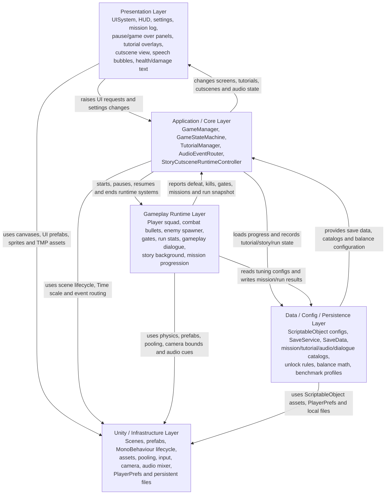

# True Gate Architecture Diagrams

Tai lieu nay gom 3 diagram co the dan truc tiep vao bao cao:

- Class diagram: tap trung vao cac runtime system quan trong va ten method/property dang co trong code.
- Layered architecture: mo ta kien truc theo tang, chi giu cac mui ten cap he thong.
- Gameplay runtime flow: mo ta duong chay chinh tu UI/Input den run, tutorial, mission, game over, save, audio va cutscene.

## Class Diagram

```mermaid
classDiagram
    direction LR

    class GameManager {
        +Init()
        +PrepareRunForTutorial()
        +StartNormalRunFromTutorial()
        +NotifyGameplayTutorialCompleted()
        +event RunBecamePlayable
        +event RunEnded
        +event ReturnedToMenu
        -StartRun()
        -PauseRun()
        -ResumeRun()
        -HandleSquadDefeated()
        -ShowGameOverScreen()
    }

    class GameStateMachine {
        +GameState CurrentState
        +SetState(GameState nextState)
        +event StateChanged
    }

    class GameState {
        <<enumeration>>
        Bootstrap
        MainMenu
        Playing
        Cutscene
        Paused
        GameOver
    }

    class UISystem {
        +UIScreen CurrentScreen
        +Init(RunStatsTracker tracker)
        +ShowMainMenu()
        +ShowGameplayHud()
        +ShowPause()
        +ShowSettingsFromMainMenu()
        +ShowSettingsFromPause()
        +ShowMissionLog()
        +ShowGameOver(RunStatsSnapshot snapshot)
        +ShowMissionButtonCompleteFeedback()
        +event PlayRequested
        +event ScreenChanged
        +event UiCueRequested
        +event MusicSettingChanged
        +event SfxSettingChanged
    }

    class RunStatsTracker {
        +BeginRun()
        +EndRun()
        +CreateSnapshot()
        +SetPersistenceSuppressed(bool suppressed)
    }

    class TutorialManager {
        +Init()
        +ShouldRunGameplayTutorial()
        +StartGameplayTutorial()
        +StartUpdateOnboardingFromMainMenu()
        +CompleteGameplayTutorial(bool startNormalRun)
        +CompleteUpdateOnboarding()
        +ShowStartRunSpotlightIfNeeded()
    }

    class MissionSystem {
        <<runtime service>>
        +MissionDefinition ActiveMission
        +bool MissionNotificationUnread
        +bool HasAnyUnclaimedMissionRewards
        +InitializeFromSave()
        +NotifyGateSelected(GateConfig config, bool isTutorialGate)
        +NotifyUpgradePurchased()
        +NotifyGameplayTutorialCompleted()
        +NotifyFinalChoiceResolved(string branchId)
        +EndRun(RunStatsSnapshot snapshot)
        +TryClaimMissionReward(string missionId)
        +event MissionCompleted
    }

    class PlayerController {
        +MainPlayerUnit MainPlayerUnit
        +IReadOnlyList~FollowerUnit~ Followers
        +SetControlsEnabled(bool isEnabled)
        +SetSquadCount(int targetCount)
        +ShootSquad()
        +ApplyGateEffect(GateConfig config)
        +event SquadDefeated
    }

    class PlayerUnit {
        +float Damage
        +float FireRate
        +float CurrentHp
        +float MaxHp
        +bool IsDead
        +Initialize()
        +Shoot()
        +TakeDamage(float value)
    }

    class MainPlayerUnit
    class FollowerUnit

    class EnemySpawnerSystem {
        +float ElapsedTime
        +BeginRun()
        +SetSpawningEnabled(bool isEnabled)
        +Spawn()
        +SetBalanceConfiguration()
        +SetGateSpeedMultiplier(float multiplier)
        +SetGatePressureMultiplier(float multiplier)
        +CleanupTutorialEnemies()
        +event EnemyKilled
        +event EnemyDamaged
        +event ChomboomExploded
    }

    class EnemyController {
        +int ScoreValue
        +int CoinReward
        +bool IsActive
        +Init()
        +Spawn()
        +Despawn()
        +ApplyRuntimeStats(EnemyRuntimeStats stats)
        +TakeDamage(float damageAmount)
        +CanReceiveDamageFrom(GameObject damageSource)
    }

    class GateSystem {
        +float CurrentMajorChance
        +BeginRun()
        +SetSpawningEnabled(bool isEnabled)
        +SetBenchmarkMode(bool isBenchmarkMode)
        +SetGatePoolConfig(GatePoolConfig value)
        +SetGateScalingProfile(GateScalingProfile value)
        +Spawn()
        +SpawnTutorialDefaultGateSet()
        +ApplyGateConfig(GateConfig config)
        +HandleGateChosen(GateLogic chosenGate)
        +event GateShown
        +event GateSelected
        +event MajorRollEvaluated
    }

    class GateRuntimeEffectController {
        +SetGateScalingProfile(GateScalingProfile profile)
        +Configure()
        +BeginRun()
        +Apply(GateConfig config)
    }

    class GateLogic {
        +GateConfig GateConfig
        +Init()
        +Spawn()
        +Despawn()
        +ApplyEffect()
        +HandlePlayerTriggered(MainPlayerUnit hitPlayer)
    }

    class GateEffectApplier {
        <<static>>
        +Apply(GateConfig config, MainPlayerUnit mainUnit, PlayerController squad)
    }

    class BulletSpawner {
        +event VolleyFired
        +Initialize(float damage, float fireRate)
        +Shoot()
        +SpawnChildBullet()
        +SetDamage(float value)
        +SetFireRate(float value)
        +SetProjectileCount(int value)
        +AddModifier(BulletModifierConfig modifierConfig)
    }

    class Bullet {
        +float Damage
        +float Speed
        +Init(float bulletDamage, float bulletSpeed)
        +Spawn()
        +Despawn()
        +Configure(BulletSpawner ownerSpawner, IReadOnlyList~BulletModifierConfig~ modifierConfigs)
    }

    class IBulletModifier {
        <<interface>>
        +OnInit(Bullet bullet)
        +OnUpdate(Bullet bullet)
        +OnHit(Bullet bullet, Collider2D target)
    }

    class IDamageable {
        <<interface>>
        +TakeDamage(float value)
    }

    class IConditionalDamageable {
        <<interface>>
        +CanReceiveDamageFrom(GameObject damageSource)
    }

    class IPoolable {
        <<interface>>
        +Spawn()
        +Despawn()
    }

    class IGateEffect {
        <<interface>>
        +ApplyEffect()
    }

    class GameplayDialogueController {
        +PsychologyPhase CurrentPhase
        +Init()
        +BeginNormalRun()
        +EndRun()
        +Suspend()
        +Resume()
        +ShowByDialogueId(string dialogueId)
        +event DialogueShown
    }

    class SpeechBubblePresenter {
        +Configure(PlayerController playerController, RectTransform targetLayer)
        +Show(string text, PlayerController playerController)
        +HideImmediate()
    }

    class StoryProgressBackgroundController {
        +RefreshBackground()
    }

    class AudioEventRouter {
        +BindMissionSystem(MissionSystem missionSystem)
    }

    class AudioSystem {
        +Initialize()
        +PlayMusic(AudioCueId cue)
        +PlaySfx(AudioCueId cue)
        +PlayUi(AudioCueId cue)
        +PlayDialogue(AudioCueId cue)
        +ApplySavedSettings()
        +SetMusicEnabled(bool enabled)
        +SetSfxEnabled(bool enabled)
    }

    class SaveService {
        <<singleton>>
        +SaveData Data
        +EnsureLoaded()
        +LoadAsync()
        +SaveAsync()
        +RecordRunResult()
        +RecordCutsceneSeen()
        +TryPurchaseUpgrade()
        +MarkGameplayTutorialCompleted()
        +MarkUpdateOnboardingCompleted()
        +GrantMissionRewardOnce()
        +CommitMissionState()
        +MarkFinalChoiceResolved()
        +ResetPlayerProgression()
        +event DataChanged
        +event UpgradePurchased
    }

    class SaveData {
        +int totalRunsCompleted
        +int totalEnemyKills
        +int walletCoins
        +bool gameplayTutorialCompleted
        +bool upgradeTutorialCompleted
        +string activeMissionId
        +bool missionNotificationUnread
        +bool finalChoiceResolved
        +bool HasSeenCutscene(string cutsceneId)
        +bool MarkCutsceneSeen(string cutsceneId)
    }

    class StoryCutsceneRuntimeController {
        +bool IsPlaying
        +Init()
        +TryPlayInitialCutscene()
        +TryPlayPostRunCutscene()
        +TryPlayCutscene(string cutsceneId)
        +TryPlayTransientCutscene(StoryCutsceneDefinition definition)
    }

    class StoryCutsceneDirector {
        +Play(string cutsceneId)
        +PlayTransient(StoryCutsceneDefinition definition)
        +event OnCutsceneStarted
        +event OnCutsceneFinished
        +event OnDialogueLineShown
        +event OnFinalChoiceSelected
    }

    class StoryCutsceneUnlockRules {
        <<static>>
        +IsEligible()
        +TryGetFirstEligible()
        +NormalizePlayableCutsceneId()
    }

    class BalanceBootstrapConfig {
        <<ScriptableObject>>
        +CombatScalingConfig CombatScalingConfig
        +PlayerMetaBalanceConfig PlayerMetaBalanceConfig
        +PlayerMetaEconomyConfig PlayerMetaEconomyConfig
        +GatePoolConfig GatePoolConfig
        +GateScalingProfile GateScalingProfile
        +BalanceBenchmarkProfile ActiveBenchmarkProfile
        +RunPressureConfig RunPressureConfig
        +IReadOnlyList~EnemyRoleConfig~ EnemyRoleConfigs
    }

    class MissionCatalog {
        <<ScriptableObject>>
        +IReadOnlyList~MissionDefinition~ Missions
        +GetMissionById(string missionId)
        +CreateRuntimeDefault()
    }

    class GameplayDialogueCatalog {
        <<ScriptableObject>>
    }

    class AudioCatalog {
        <<ScriptableObject>>
    }

    class TutorialConfig {
        <<ScriptableObject>>
    }

    class GateConfig {
        <<ScriptableObject>>
        +GateStatTarget StatTarget
        +GateOperationType OperationType
        +float Amount
        +BalanceGateCategory Category
        +IReadOnlyList~GateRuntimeEffect~ RuntimeEffects
        +bool HasRuntimeEffects
        +ConfigureRuntime()
        +GetDisplayText()
    }

    class GatePoolConfig {
        <<ScriptableObject>>
        +float GateCadenceSeconds
        +float MajorGateCadenceSeconds
    }

    class GateScalingProfile {
        <<ScriptableObject>>
        +IReadOnlyList~GateScalingPhase~ Phases
        +GetMajorChance(float elapsedSeconds)
    }

    class RunPressureConfig {
        <<ScriptableObject>>
    }

    GameManager --> GameStateMachine : controls state
    GameStateMachine --> GameState : stores
    GameManager --> UISystem : screen commands
    GameManager --> TutorialManager : tutorial gating
    GameManager --> MissionSystem : mission progression
    GameManager --> PlayerController : run controls
    GameManager --> EnemySpawnerSystem : run controls
    GameManager --> GateSystem : run controls
    GameManager --> RunStatsTracker : run snapshot
    GameManager --> GameplayDialogueController : run dialogue
    GameManager --> StoryCutsceneRuntimeController : story flow
    GameManager --> SaveService : progress data
    GameManager --> BalanceBootstrapConfig : balance entrypoint

    UISystem --> MissionSystem : mission log
    UISystem --> SaveService : wallet and settings
    TutorialManager --> GameManager : prepares tutorial run
    TutorialManager --> StoryCutsceneRuntimeController : transient tutorial cutscenes
    MissionSystem --> MissionCatalog : reads definitions
    MissionSystem --> SaveService : persists progress

    PlayerController *-- MainPlayerUnit : owns
    PlayerController o-- FollowerUnit : manages
    MainPlayerUnit --|> PlayerUnit
    FollowerUnit --|> PlayerUnit
    PlayerUnit ..|> IDamageable
    PlayerUnit --> BulletSpawner : fires
    BulletSpawner --> Bullet : creates
    BulletSpawner --> IBulletModifier : configures hooks
    Bullet ..|> IPoolable
    Bullet --> IDamageable : deals damage

    EnemySpawnerSystem --> EnemyController : spawns
    EnemySpawnerSystem --> RunPressureConfig : pressure data
    EnemyController ..|> IDamageable
    EnemyController ..|> IConditionalDamageable
    EnemyController ..|> IPoolable
    EnemyController --> PlayerUnit : attacks

    GateSystem --> GateLogic : creates offers
    GateSystem --> GateRuntimeEffectController : applies selected gate
    GateSystem --> GatePoolConfig : offer data
    GateSystem --> GateScalingProfile : major gate scaling
    GateLogic --> GateConfig : displays config
    GateLogic ..|> IPoolable
    GateLogic ..|> IGateEffect
    GateRuntimeEffectController --> GateConfig : reads runtime effects
    GateEffectApplier --> GateConfig : applies simple effects

    GameplayDialogueController --> GameplayDialogueCatalog : reads lines
    GameplayDialogueController --> SpeechBubblePresenter : displays bubbles
    GameplayDialogueController --> SaveService : resolves psychology phase
    StoryProgressBackgroundController --> SaveService : tracks story phase

    AudioEventRouter --> AudioSystem : plays cues
    AudioEventRouter --> UISystem : listens UI events
    AudioEventRouter --> GameManager : listens run events
    AudioEventRouter --> EnemySpawnerSystem : listens enemy events
    AudioEventRouter --> GateSystem : listens gate events
    AudioEventRouter --> StoryCutsceneDirector : listens cutscene events
    AudioEventRouter --> GameplayDialogueController : listens dialogue events
    AudioSystem --> AudioCatalog : reads cue data

    StoryCutsceneRuntimeController --> StoryCutsceneDirector : plays
    StoryCutsceneRuntimeController --> StoryCutsceneUnlockRules : checks unlocks
    StoryCutsceneRuntimeController --> SaveService : reads and records
    StoryCutsceneRuntimeController --> MissionSystem : final choice progress
    SaveService *-- SaveData : owns
    RunStatsTracker --> SaveService : records result
```

Note: The class diagram intentionally omits secondary/helper systems such as `CombatSystem`, `LevelSystem`, `BalanceTelemetryService`, `PoolSystem`, individual UI row/layout classes, editor tools, DTO rows, and some config subtypes to keep the report readable. `GameManager` and the runtime systems still reference several of those classes in code.

## Layered Architecture

```mermaid
flowchart TB
    Presentation["Presentation Layer\nUISystem, HUD, settings, mission log,\npause/game over panels, tutorial overlays,\ncutscene view, speech bubbles, health/damage text"]
    Application["Application / Core Layer\nGameManager, GameStateMachine,\nTutorialManager, AudioEventRouter,\nStoryCutsceneRuntimeController"]
    Gameplay["Gameplay Runtime Layer\nPlayer squad, combat bullets, enemy spawner,\ngates, run stats, gameplay dialogue,\nstory background, mission progression"]
    Data["Data / Config / Persistence Layer\nScriptableObject configs, SaveService, SaveData,\nmission/tutorial/audio/dialogue catalogs,\nunlock rules, balance math, benchmark profiles"]
    UnityInfra["Unity / Infrastructure Layer\nScenes, prefabs, MonoBehaviour lifecycle,\nassets, pooling, input, camera, audio mixer,\nPlayerPrefs and persistent files"]

    Presentation -->|raises UI requests and settings changes| Application
    Application -->|changes screens, tutorials, cutscenes and audio state| Presentation
    Application -->|starts, pauses, resumes and ends runtime systems| Gameplay
    Gameplay -->|reports defeat, kills, gates, missions and run snapshot| Application
    Application -->|loads progress and records tutorial/story/run state| Data
    Data -->|provides save data, catalogs and balance configuration| Application
    Gameplay -->|reads tuning configs and writes mission/run results| Data
    Presentation -->|uses canvases, UI prefabs, sprites and TMP assets| UnityInfra
    Application -->|uses scene lifecycle, Time scale and event routing| UnityInfra
    Gameplay -->|uses physics, prefabs, pooling, camera bounds and audio cues| UnityInfra
    Data -->|uses ScriptableObject assets, PlayerPrefs and local files| UnityInfra
```

## Gameplay Runtime Flow

```mermaid
flowchart LR
    InputUI["Input / UI\nPlay, pause, retry, home,\nsettings, mission log"] -->|PlayRequested| GM["GameManager"]
    GM -->|tutorial needed| Tutorial["TutorialManager"]
    Tutorial -->|PrepareRunForTutorial| TutorialRun["Tutorial run\ncontrols enabled,\nenemy/gate spawning held"]
    TutorialRun -->|CompleteGameplayTutorial| NormalFromTutorial["StartNormalRunFromTutorial"]
    GM -->|standard play| Begin["StartRun / BeginRun phase"]
    NormalFromTutorial --> Begin

    Begin -->|apply meta or benchmark stats| Player["PlayerController\nMainPlayerUnit + followers"]
    Begin -->|BeginRun + enable spawning| Enemies["EnemySpawnerSystem"]
    Begin -->|BeginRun + gate scaling| Gates["GateSystem"]
    Begin -->|BeginRun| Stats["RunStatsTracker"]
    Begin -->|BeginNormalRun| Dialogue["GameplayDialogueController\nSpeechBubblePresenter"]
    Begin -->|ShowGameplayHud| HUD["UISystem\nGameplay HUD"]
    Begin -->|RunBecamePlayable| Audio["AudioEventRouter\nAudioSystem"]

    Player -->|ShootSquad| Combat["BulletSpawner + Bullet"]
    Combat -->|damage and damage text| Enemies
    Enemies -->|EnemyKilled / EnemyDamaged| Stats
    Enemies -->|enemy audio cues| Audio
    Gates -->|GateSelected| Mission["MissionSystem"]
    Gates -->|Apply GateConfig| Player
    Gates -->|runtime modifiers| Enemies
    Gates -->|gate audio cues| Audio
    SaveDataPhase["SaveData story phase"] -->|resolve psychology phase| Dialogue
    SaveDataPhase -->|select background| Background["StoryProgressBackgroundController"]

    Player -->|SquadDefeated event| GM
    GM -->|RunEnded + EndRun| Dialogue
    GM -->|EndRun and CreateSnapshot| Stats
    Stats -->|RecordRunResult| Save["SaveService / SaveData"]
    Stats -->|mission snapshot| Mission
    Mission -->|completed / reward / active mission| Save
    Mission -->|mission badge and log| HUD

    GM -->|TryPlayPostRunCutscene| StoryRuntime["StoryCutsceneRuntimeController"]
    StoryRuntime -->|eligible Play cutsceneId| StoryDirector["StoryCutsceneDirector"]
    StoryDirector -->|cutscene and dialogue cues| Audio
    StoryRuntime -->|RecordCutsceneSeen / final choice| Save
    StoryRuntime -->|final choice resolved| Mission
    StoryDirector -->|finished callback| GM
    GM -->|first-death onboarding needed| UpdateOnboarding["UpdateOnboardingDirector\nmain menu tutorial"]
    GM -->|ShowGameOver with snapshot| GameOverUI["UISystem\nGame over panel"]
    Save -->|wallet, best run, tutorial and mission flags| GameOverUI
```

## Notes For Report

- `GameManager` van la trung tam dieu phoi: nhan request tu UI, chon tutorial hay normal run, bat dau run, pause/resume, xu ly squad defeated, story cutscene, update onboarding va game over.
- `MissionSystem` la runtime service khong ke thua `MonoBehaviour`; no doc `MissionCatalog`, tao snapshot tu `SaveData`/`RunStatsSnapshot`, cap nhat active mission, reward va mission notification.
- `TutorialManager` dieu phoi gameplay tutorial va update onboarding; no co the yeu cau `GameManager` tao tutorial run truoc khi chuyen sang normal run.
- `AudioEventRouter` gom event tu UI, run, enemy, gate, bullet, mission, cutscene va gameplay dialogue roi goi `AudioSystem`; `AudioSystem` doc cue tu `AudioCatalog`.
- `GameplayDialogueController` dung `GameplayDialogueCatalog`, `StoryPsychologyPhaseResolver` va `SaveData` de hien speech bubble theo giai doan tam ly cua story; `StoryProgressBackgroundController` cung doc giai doan nay de doi background.
- Class diagram chi giu cac class runtime quan trong; cac dependency nho nhu layout UI, editor tool, third-party package, DTO chi tiet va telemetry row duoc loai ra de tranh roi.
- Layered architecture chi mo ta quan he cap he thong. Chi tiet Player, Enemy, Gate, Combat, Mission, Tutorial, Audio va Dialogue duoc tach sang class diagram va runtime flow.
