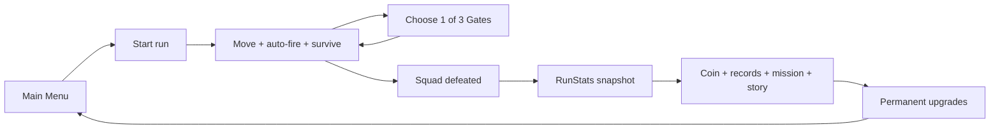
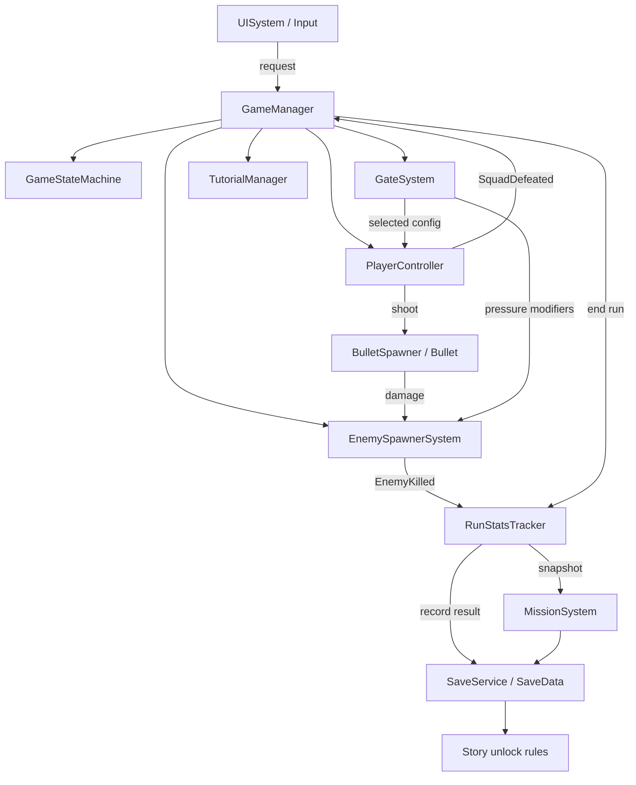
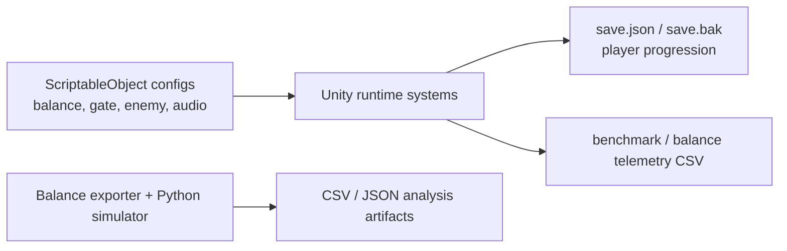

# True Gate — Demo & Code Defense Playbook

Tài liệu này dùng cho buổi demo cuối môn. Mục tiêu không phải học thuộc toàn bộ project, mà là nắm được câu chuyện sản phẩm, luồng runtime, nguồn dữ liệu, vài quyết định kỹ thuật quan trọng và giới hạn thật của bản beta.

## 1. Năm ý phải nhớ dù bị khớp

1. **True Gate là gì:** game mobile 2D portrait thuộc dạng survival auto-shooter; người chơi kéo ngang, squad tự bắn và chọn một trong ba Gate để thay đổi run.
2. **Điểm khác biệt:** Gate tạo quyết định ngắn hạn; coin, upgrade, mission và story tạo vòng lặp dài hạn.
3. **Code chạy thế nào:** UI phát request → `GameManager` điều phối state và subsystem → Player/Enemy/Gate chạy gameplay → `RunStatsTracker` tạo snapshot → Mission/Story/Save xử lý hậu run.
4. **Dữ liệu nằm đâu:** balance dùng ScriptableObject; mô phỏng balance xuất CSV/JSON; tiến trình người chơi lưu JSON cục bộ. Không có dataset huấn luyện AI/ML.
5. **Bằng chứng chất lượng:** có EditMode, PlayMode, Android build và benchmark thiết bị thật; phải nói đúng giới hạn, không biến số test thành code coverage và không nói game đạt 60 FPS.

Nếu chỉ còn 20 giây để trả lời, quay lại năm ý này.

## 2. Opening script 45–60 giây

> Em xin giới thiệu True Gate, một game mobile 2D portrait thuộc thể loại survival auto-shooter. Người chơi điều khiển UNIT-07 bằng thao tác kéo ngang, còn đội hình tự động tấn công. Cứ khoảng 15 giây, ba Gate xuất hiện và người chơi phải chọn nhanh giữa tăng sức mạnh, tăng khả năng sống sót hoặc nhận một buff lớn kèm đánh đổi. Sau mỗi run, kết quả được chuyển thành coin, mission progress, permanent upgrade và story progress. Về kỹ thuật, project dùng Unity 6, một scene runtime chính, GameManager làm lớp điều phối, các subsystem tách riêng cho player, enemy, gate, mission, tutorial, story, audio và save. Phần balance được data-driven bằng ScriptableObject, còn đối tượng xuất hiện thường xuyên như enemy và projectile được tái sử dụng qua object pool.

Đừng đọc như MC. Chỉ cần thuộc thứ tự ý:

`thể loại → thao tác → Gate → meta loop → kiến trúc → data/pooling`.

## 3. Run sheet demo 6–8 phút

### 0:00–0:45 — Giới thiệu sản phẩm

- Nói opening script ở trên.
- Chỉ Main Menu và nói đây là build portrait dành cho Android.
- Không mở code ngay; trước tiên cho cô thấy sản phẩm chạy.

### 0:45–2:30 — Core gameplay

- Bấm `START RUN`.
- Nếu tutorial xuất hiện, trình bày ngắn: tutorial chỉ chạy khi save chưa đánh dấu hoàn thành; sau đó skip để tiết kiệm thời gian.
- Kéo UNIT-07 theo trục X và nói bắn là tự động, input trên UI không làm player di chuyển.
- Khi enemy xuất hiện, chỉ ba vai trò dễ nhìn: Basic, Chomboom và Vomfy. Không cần chờ mọi archetype.
- Chờ bộ ba Gate đầu tiên và chọn một Gate. Giải thích Gate còn lại bị khóa/despawn và hiệu ứng được áp dụng vào player hoặc runtime pressure.

Câu chuyển:

> Phần vừa thấy là loop trong một run. Bây giờ em chuyển sang phần giữ người chơi qua nhiều run.

### 2:30–3:45 — Meta loop

- Mở Pause/Settings thật nhanh để chứng minh state và setting hoạt động, rồi Resume.
- Cho run kết thúc nếu thuận tiện; nếu sẽ tốn thời gian, dùng ảnh Game Over đã chuẩn bị và nói rõ đây là capture từ Unity Game View, không giả vờ là live.
- Chỉ Game Over snapshot: survival time, kill, coin, score và best record.
- Mở Upgrade, cho thấy năm track: Damage, Fire Rate, Max HP, Projectile Count, Squad Size.
- Mở Mission Log, cho thấy active/completed/locked và cơ chế claim reward một lần.

### 3:45–5:00 — Story và persistence

- Chỉ một cutscene hoặc screenshot cutscene.
- Nói story được unlock từ save + kết quả run; nó không phải video cố định chạy sau mọi lần chết.
- Nói save schema hiện tại là 11; lưu progression, wallet, mission, tutorial, cutscene đã xem và final choice.
- Nói audio/settings toggle dùng PlayerPrefs riêng, còn progression dùng JSON local save.

### 5:00–6:30 — Luồng xử lý và code

Mở code theo đúng thứ tự sau:

1. `GameManager.StartRunInternal()` — chứng minh lớp điều phối khởi động các subsystem.
2. `GameManager.HandleSquadDefeated()` — chứng minh đường đi khi kết thúc run.
3. `GateSystem.HandleGateChosen()` hoặc `ApplyGateConfig()` — chứng minh lựa chọn Gate đi vào gameplay.
4. `RunStatsTracker.EndRun()`/`CreateSnapshot()` — chứng minh dữ liệu run được tổng hợp.
5. `SaveService.RecordRunResult()` hoặc `TryPurchaseUpgrade()` — chứng minh persistence.
6. `PoolSystem.Spawn()`/`Release()` — nếu cô hỏi tối ưu.

Không scroll ngẫu nhiên. Chuẩn bị bookmark hoặc mở sẵn tab trước buổi demo.

### 6:30–7:30 — Test, dữ liệu và kết luận

- Chỉ active balance config `balance-v1.4.1-meta-stat-progression`.
- Chỉ một CSV dễ hiểu như `progression_checkpoints.csv` hoặc `gate_phase_values.csv`.
- Nói test artifact gần nhất ghi nhận 216 EditMode và 41 PlayMode pass tại lần benchmark ngày 09/08/2026. Đây không phải 100% code coverage.
- Nói benchmark Android ổn định gần 30 FPS nhưng chưa đạt target 60 FPS; đây là giới hạn và hướng tối ưu tiếp theo.

Kết:

> Sản phẩm hiện hoàn thành core loop, meta progression, mission, story, save và Android beta flow. Phần cần tiếp tục là tối ưu frame pacing, mở rộng device matrix và tích hợp cloud provider thật nếu đưa lên production.

## 4. Sơ đồ nên trình bày

### 4.1 Sơ đồ core loop — dùng đầu tiên

Cách nói:

> Vòng trong là combat–Gate lặp trong một run. Vòng ngoài dùng kết quả run để mở upgrade, mission và story, rồi người chơi quay lại mạnh hơn.

### 4.2 Sơ đồ runtime — dùng khi giải thích code

Cách nói:

> GameManager không tự xử lý mọi gameplay detail. Nó điều phối lifecycle. Player, Enemy, Gate và các subsystem tự sở hữu hành vi của mình, rồi giao tiếp bằng reference và event.

### 4.3 Sơ đồ dữ liệu — dùng khi cô hỏi dataset/database

## 5. Giải thích luồng xử lý bằng code thật

### Khi bấm Start Run

1. `UISystem` phát `PlayRequested`.
2. `GameManager.RequestStartRun()` quyết định chạy tutorial hay normal run.
3. Normal run đi vào `StartRun()` rồi `StartRunInternal()`.
4. Player được initialize và áp permanent meta stats.
5. `RunStatsTracker.BeginRun()`, `EnemySpawnerSystem.BeginRun()` và `GateSystem.BeginRun()` reset state theo run.
6. Controls và spawning được bật.
7. State đổi sang `Playing`, HUD hiện lên và gameplay dialogue bắt đầu.

### Khi chọn Gate

1. `GateSystem` tạo ba lựa chọn từ pool/config theo cadence.
2. `GateLogic` nhận trigger của main player.
3. `GateSystem.HandleGateChosen()` xác nhận chỉ một Gate được chọn.
4. `GateConfig` cung cấp category, magnitude, duration và drawback.
5. Hiệu ứng đơn giản áp vào squad; runtime effect có thể tác động enemy speed/pressure, barrier, freeze, coin multiplier hoặc stat khác.
6. `MissionSystem.NotifyGateSelected()` cập nhật mission, trừ tutorial Gate.

### Khi bắn trúng enemy

1. Mỗi unit gọi `BulletSpawner.Shoot()` theo effective fire rate.
2. Spawner lấy Bullet từ `PoolSystem` nếu có, rồi gọi `Init()`, `Configure()` và `Spawn()`.
3. Bullet có thể nhận modifier qua interface/hook như homing, pierce, split.
4. Khi va chạm, target qua `IDamageable`; enemy kiểm tra thêm nguồn damage khi cần.
5. Enemy chết phát event; spawner và stats cập nhật kill/reward rồi object được trả về pool.

### Khi squad chết

1. `PlayerController` phát `SquadDefeated` khi không còn unit sống.
2. `GameManager.HandleSquadDefeated()` khóa input và spawning.
3. `RunStatsTracker.EndRun()` chốt coin/score và gọi save nếu không phải benchmark suppressed.
4. `CreateSnapshot()` đóng gói kết quả để UI, mission, telemetry và story dùng cùng một dữ liệu.
5. Mission đánh giá progress; story kiểm tra cutscene đủ điều kiện.
6. Nếu có cutscene thì state sang `Cutscene`; xong mới sang `GameOver`.

### Khi lưu dữ liệu

1. `SaveService` giữ `SaveData` đã normalize theo schema 11.
2. `LocalSaveRepository` ghi JSON vào `save.tmp`.
3. File main cũ được copy sang `save.bak`.
4. Temp được move thành `save.json`.
5. Khi load, hệ thống thử main trước, hỏng thì thử backup.

Nói chính xác: đây là cơ chế giảm rủi ro ghi file, chưa phải transaction tuyệt đối. Automated corrupt-file/interrupted-write coverage vẫn là phần có thể mở rộng.

## 6. “Dataset của em đâu?” — câu trả lời chuẩn

> Project của em không huấn luyện mô hình machine learning nên không có training dataset. Em chia dữ liệu thành ba nhóm. Thứ nhất là dữ liệu thiết kế và balance trong ScriptableObject, là nguồn cấu hình runtime. Thứ hai là dữ liệu phân tích được exporter và Python simulator sinh ra dưới dạng CSV/JSON, ví dụ Gate theo phase và checkpoint progression. Thứ ba là dữ liệu vận hành của từng người chơi trong local save. Ngoài ra benchmark có raw telemetry riêng, nhưng đó là measurement data chứ không phải training dataset.

### Nguồn dữ liệu nên mở

- Active runtime balance: `Assets/_Project/Data/Balance/V1_4_1_MetaProgression/BalanceBootstrapConfig_v1_4_1_MetaProgression.asset`.
- Scene đang reference đúng asset trên trong `Assets/_Project/Scenes/Main.unity`.
- Gate data đã export: `Tools/Balance/output/balance-v1.4.1-meta-stat-progression/gate_phase_values.csv` — 65 dòng dữ liệu.
- Progression checkpoints: `Tools/Balance/output/balance-v1.4.1-meta-stat-progression/progression_checkpoints.csv` — 9 dòng dữ liệu.
- Benchmark target: `Tools/Balance/output/balance-v1.4.1-meta-stat-progression/benchmark_target_curve.csv`.
- Player progression schema: `SaveData.cs`.
- Performance measurement: `Assets/_Project/Documentation/Performance/Performance_Benchmark_Raw.csv` và summary/report cùng thư mục.

### Cảnh báo quan trọng

Các file CSV nằm trực tiếp ở `Tools/Balance/output/` là export cũ `balance-v1.0.0`. Đừng dùng chúng để chứng minh balance active hiện tại. Khi demo hãy mở thư mục versioned `balance-v1.4.1-meta-stat-progression` và nói rõ version.

## 7. Code map để không lạc

| Câu hỏi | File/class nên mở | Ý cần chỉ |
|---|---|---|
| Game bắt đầu/kết thúc thế nào? | `GameManager.cs` | `StartRunInternal`, `HandleSquadDefeated` |
| State quản lý ở đâu? | `GameStateMachine.cs` | enum 6 state, `SetState`, event `StateChanged` |
| Player và squad? | `PlayerController.cs`, `PlayerUnit.cs` | ownership, control, squad defeat |
| Bắn đạn? | `BulletSpawner.cs`, `Bullet.cs` | fire interval, projectile count, modifier, pool |
| Enemy scale? | `EnemySpawnerSystem.cs`, `RunPressureConfig.cs` | elapsed time → pressure node/interpolation → runtime stats |
| Gate chọn và áp effect? | `GateSystem.cs`, `GateConfig.cs`, `GateRuntimeEffectController.cs` | offer, chosen gate, config, runtime modifier |
| Tại sao dùng pool? | `PoolSystem.cs` | queue theo prefab, spawn/release, giảm instantiate/destroy |
| Chốt kết quả run? | `RunStatsTracker.cs` | event kill, coin/score, snapshot |
| Mission tính progress? | `MissionSystem.cs`, `MissionProgressEvaluator.cs` | absolute/delta/best single run |
| Story unlock? | `StoryCutsceneUnlockRules.cs` | prerequisite + loop/time/kill boundaries |
| Save an toàn thế nào? | `SaveService.cs`, `LocalSaveRepository.cs`, `SaveData.cs` | normalize, temp/backup/main, idempotency |
| Balance data ở đâu? | `BalanceBootstrapConfig.cs` và asset v1.4.1 | một entrypoint tới các config nhỏ |
| UI không dính gameplay? | `UISystem.cs`, `GameManager.cs` | UI phát request; coordinator ra command |

## 8. Câu hỏi code dễ bị hỏi

### “Tại sao GameManager to như vậy? Có phải God Object không?”

> GameManager hiện là composition root và coordinator cho lifecycle của run. Nó giữ wiring và quyết định thứ tự start/pause/end, còn logic cục bộ nằm trong Player, Enemy, Gate, Mission, Tutorial, Story và Save. Tuy nhiên class vẫn khá lớn; nếu mở rộng production, em sẽ tách run orchestration, story routing và bootstrap/wiring thành service riêng để giảm coupling và dễ test hơn.

Đây là câu trả lời tốt hơn việc phủ nhận nhược điểm.

### “Tại sao dùng ScriptableObject?”

> Vì balance cần chỉnh mà không sửa code, có thể version hóa asset, reuse giữa runtime/exporter/test và serialize reference trực tiếp trong scene. Nhược điểm là phải quản lý reference/version cẩn thận; project giải quyết bằng một `BalanceBootstrapConfig` làm entrypoint và các thư mục versioned.

### “Tại sao dùng event?”

> Event dùng cho thông báo một-nhiều như enemy killed, squad defeated, UI request, mission completed và audio cue. Bên phát không cần biết mọi bên nghe. Các component unsubscribe ở lifecycle phù hợp để tránh callback vào object đã destroy.

### “Object pooling hoạt động thế nào?”

> Pool giữ một queue theo prefab. Spawn lấy object inactive hoặc tạo mới khi queue rỗng; Release tắt object và enqueue lại. `IPoolable.Spawn/Despawn` cho object reset lifecycle riêng. Điều này phù hợp với Bullet và Enemy vì chúng xuất hiện/hủy liên tục.

### “Tại sao vẫn có Instantiate fallback?”

> Để component vẫn chạy khi pool chưa được wire, nhưng production scene nên gán PoolSystem. Fallback tăng robustness trong fixture/editor; đường tối ưu vẫn là pool.

### “State machine có chặn transition sai không?”

> Hiện tại state machine là state holder tối giản: bỏ qua same-state và phát event khi đổi state; rule transition nằm ở GameManager. Đây là đủ cho sáu state hiện tại nhưng chưa phải finite-state machine có transition table. Khi flow phức tạp hơn em sẽ đưa guard/transition map vào state machine.

### “Enemy khó dần bằng cách nào?”

> `EnemySpawnerSystem` dùng elapsed time để lấy `RunPressureConfig`: active cap, spawn rate, threat budget và multiplier HP/damage/speed. Giá trị được nội suy giữa các mốc thời gian, sau đó áp vào runtime stats của enemy. Archetype còn có unlock time và threat riêng.

### “Gate có hoàn toàn random không?”

> Không phải random thuần. Gate có pool/category rule, cadence, major eligibility, major chance theo phase và cơ chế tránh offer không hợp lệ. Major bắt đầu đủ điều kiện ở mốc 60 giây theo balance hiện tại.

### “Mission progress khác nhau thế nào?”

> `AbsoluteLifetime` đọc tổng tích lũy; `DeltaSinceUnlock` trừ baseline lúc mở mission; `BestSingleRun` giữ kết quả tốt nhất của một run. Vì vậy mission mới không tự hoàn thành sai bằng progress cũ khi thiết kế yêu cầu bắt đầu đếm từ lúc unlock.

### “Làm sao không claim reward hai lần?”

> Save lưu ID reward đã cấp; `GrantMissionRewardOnce()` kiểm tra ID trước khi cộng coin. Purchase cũng kiểm tra wallet, level cap và commit state. Đây là idempotency ở tầng local progression.

### “Cloud save có chạy chưa?”

> Chưa. Code có `ICloudSaveProvider`, conflict model và merge/upload flow, nhưng provider runtime hiện tại là `NoOpCloudSaveProvider`. Em chỉ claim kiến trúc sẵn sàng tích hợp, không claim cloud production.

### “Single scene có tốt không?”

> Với beta nhỏ, một scene giảm transition/loading complexity và giữ UI/runtime wiring trực quan. Đổi lại scene lớn và coupling authoring tăng. Nếu content mở rộng, em sẽ tách bootstrap, menu và gameplay hoặc dùng additive scene.

### “Tại sao save JSON, không database?”

> Đây là game offline beta một người chơi, dữ liệu nhỏ và cần dễ migrate/debug nên JSON local hợp scope. Database/server chỉ cần khi có account, leaderboard, cross-device sync hoặc anti-cheat mạnh hơn.

### “Async SaveAsync mà repository ghi sync là sao?”

> Local repository hiện ghi file đồng bộ; async wrapper phục vụ cloud merge/upload và API thống nhất. Với save nhỏ thì chấp nhận được, nhưng production có thể đưa file I/O ra background/task phù hợp và đảm bảo Unity object không bị truy cập ngoài main thread.

### “Testing chứng minh được gì?”

> EditMode chứng minh logic/config/data rule; PlayMode bổ sung MonoBehaviour lifecycle, coroutine, physics, instantiate, scene hierarchy, UI và audio. Test pass chỉ chứng minh các assertion đã đăng ký tại artifact đó, không chứng minh 100% coverage, mọi device hoặc performance target.

### “Performance thế nào?”

> Benchmark ngày 09/08/2026 trên OPPO CPH2059 cho thấy gameplay trung bình khoảng 29.9 FPS; 1% low khoảng 22.4–25.1 FPS tùy phase. Peak Unity allocated khoảng 146.5 MiB. Kết quả chưa đạt target 60 FPS và theo ngưỡng nghiêm ngặt còn thấp hơn 30 FPS một chút. Development Build, no-Gate baseline và thermal severe là các limitation. Bước tiếp theo là profile CPU/GPU/render thread, giảm allocation và kiểm tra release build trên nhiều thiết bị.

### “Nếu có thêm thời gian, ưu tiên gì?”

1. Tối ưu và xác minh frame pacing 30/60 FPS bằng profiler, release-like build và device matrix.
2. Tách nhỏ GameManager/orchestration.
3. Thêm end-to-end test cho death → final choice → Terminal mission và corrupt-save recovery.
4. Tích hợp cloud provider thật nếu scope cần cross-device.
5. Accessibility/usability study và release signing/store pipeline.

## 9. Những câu không được nói quá

- Không nói “có AI dataset” — project không train model.
- Không nói “cloud save đã hoàn thành” — provider hiện là no-op.
- Không nói “254/257 test nghĩa là 100% coverage” — không có coverage report.
- Không nói “game chạy 60 FPS” — benchmark thiết bị thật hiện gần 30 FPS.
- Không nói “memory không leak” — đường memory tiến tới plateau nhưng bằng chứng chưa đủ kết luận tuyệt đối.
- Không nói “mọi Android đều chạy ổn” — device verification chính mới có OPPO Android 11.
- Không nói “APK sẵn sàng Play Store” — bản beta được ghi nhận dùng debug certificate; production cần release keystore.
- Không nói “mọi data ở Mission asset” — trong scene hiện `missionCatalog` đang null và GameManager fallback sang `MissionCatalog.CreateRuntimeDefault()`.

## 10. Checklist chống demo effect

### Trước một ngày

- Chốt đúng APK/build sẽ demo; không build phút cuối nếu không bắt buộc.
- Chạy lại flow: Main Menu → Tutorial/Skip → Gameplay → Gate → Pause/Settings → Game Over → Upgrade → Mission.
- Chuẩn bị hai save: fresh save để cho tutorial và progressed save để cho mission/story/upgrade. Ghi rõ file nào là file nào.
- Chụp/giữ sẵn 6 ảnh cốt lõi: Main Menu, gameplay, Gate, Upgrade, Mission, Game Over/cutscene.
- Mở sẵn code tab theo Code map.
- Mở sẵn `Docs/Architecture_Diagrams.md`, active balance CSV và performance report.
- Tắt notification, update, battery saver và app có overlay.

### Trước 30 phút

- Cắm sạc và kiểm tra cáp/ADB hoặc screen mirroring.
- Mở build và chạy thử ít nhất một Gate.
- Kiểm tra âm lượng; nếu phòng ồn, ưu tiên visual và tắt nhạc nền khi trình bày code.
- Copy APK, screenshots, slide/report và repository sang một thư mục backup/offline.
- Đặt editor font đủ lớn; đóng tab thừa và Console cũ.
- Bật Do Not Disturb.

### Plan B nếu live demo hỏng

1. Thử lại đúng một lần, tối đa 20–30 giây.
2. Chuyển sang bộ screenshots đã capture; vẫn thuyết minh cùng run sheet.
3. Dùng sơ đồ runtime để chứng minh luồng.
4. Mở code ở điểm vào/ra quan trọng.
5. Kết thúc bằng test/build/benchmark evidence.

Đừng dành ba phút sửa lỗi trước lớp. Khả năng recovery bình tĩnh cũng là một phần của demo.

## 11. Cách tập không cần học thuộc cả bài

### Vòng 1 — 15 phút

Tự nói năm ý bắt buộc mà không nhìn tài liệu. Chỗ nào vấp thì chỉ ghi keyword, không chép thêm văn mẫu.

### Vòng 2 — 20 phút

Chạy demo đúng 7 phút và quay màn hình/ghi âm. Kiểm tra:

- Có giới thiệu điểm khác biệt trước khi kể feature không?
- Có nói luồng theo nguyên nhân–kết quả không?
- Có phân biệt live result, screenshot và benchmark artifact không?
- Có lỡ claim quá về FPS/cloud/test không?

### Vòng 3 — 20 phút

Nhờ một người hỏi ngẫu nhiên 10 câu trong mục 8. Mỗi câu trả lời theo công thức:

`kết luận một câu → chỉ class/file → trade-off hoặc giới hạn`.

Ví dụ:

> Em dùng pooling cho object xuất hiện thường xuyên. Code nằm ở PoolSystem, quản lý queue theo prefab và được BulletSpawner gọi khi bắn. Nó giảm Instantiate/Destroy, nhưng pool vẫn có thể grow nếu queue cạn nên cần theo dõi peak workload.

### Vòng 4 — dress rehearsal

Tập đúng thiết bị, cáp, build, độ phân giải, thứ tự tab và tư thế đứng sẽ dùng thật. Mục tiêu là thao tác thành muscle memory để đầu óc dành cho câu hỏi.

## 12. Nguồn kiểm chứng trong repository

- Product/GDD: `Assets/_Project/Doc/GameDocument.md`.
- Sơ đồ chi tiết: `Docs/Architecture_Diagrams.md`.
- Core flow: `Assets/_Project/Scripts/Core/GameLoop/GameManager.cs`.
- Active balance: `Assets/_Project/Data/Balance/V1_4_1_MetaProgression/`.
- Balance analysis: `Tools/Balance/output/balance-v1.4.1-meta-stat-progression/`.
- Test report: `Docs/Report_Section_3_3_Testing_Expansion.md`.
- Android performance: `Assets/_Project/Documentation/Performance/Performance_Benchmark_Report.md`.
- Screenshot backup: `ReportScreenshots_TrueGate_2026-08-01/`.

